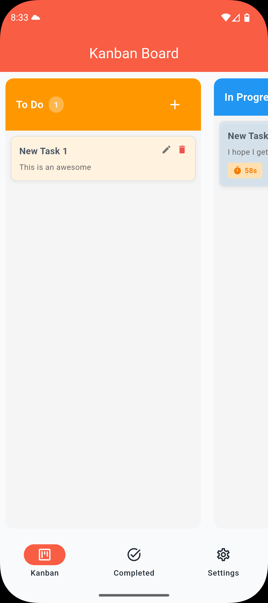
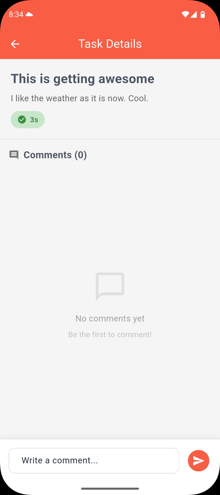
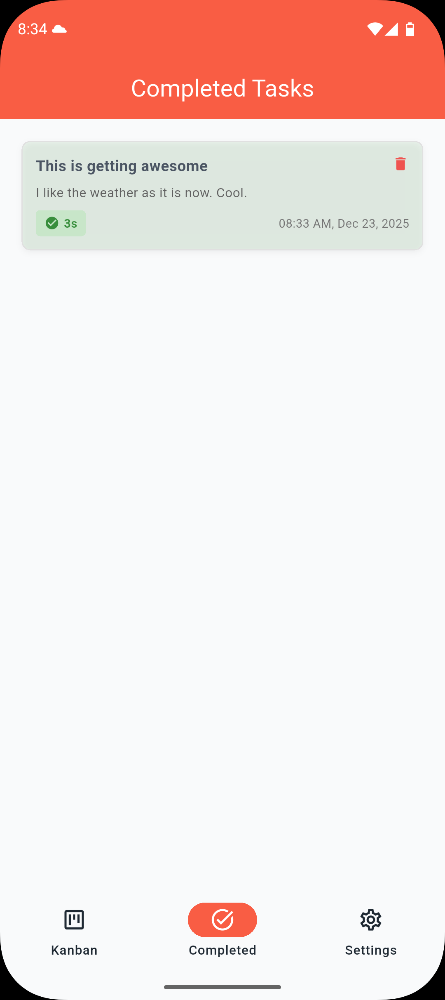
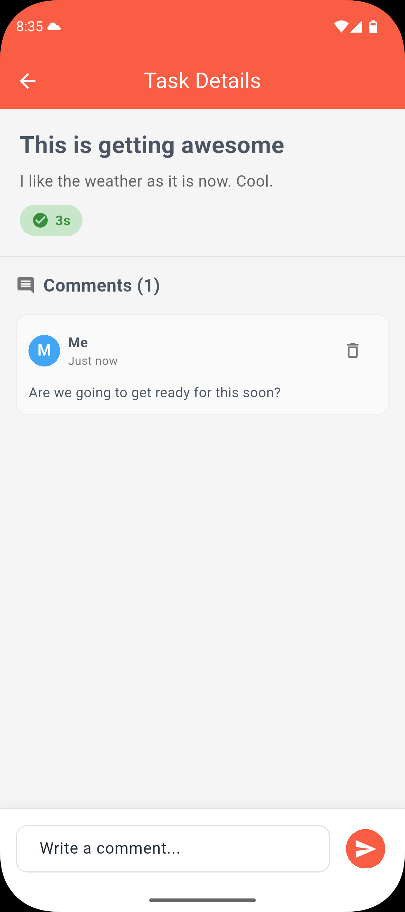
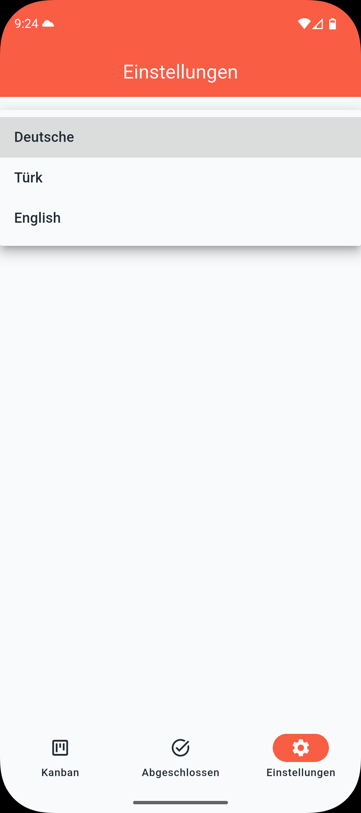
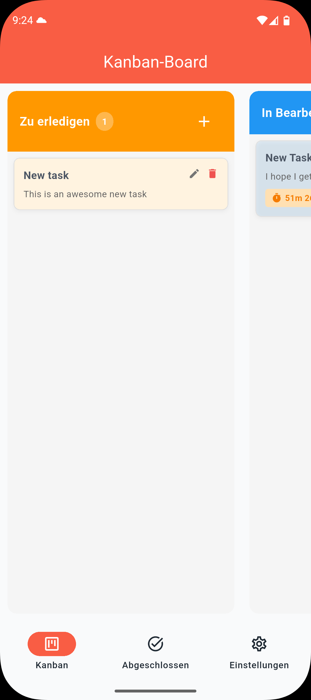
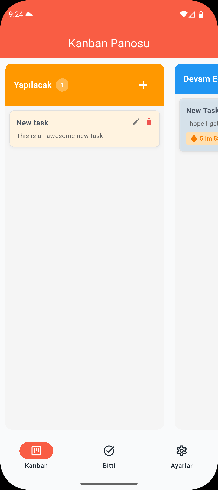

# Kanban Board with Time Tracking for In Progress Tasks

A feature-rich mobile application for task management with integrated time tracking, built with Flutter following clean architecture principles and industry best practices.

## 📱 Demo

**[Demo Video Link](https://www.loom.com/share/53a0573beb904cbbadba381a2fdb61ef)**

### Screenshots

<div style="display: flex; flex-wrap: wrap; gap: 10px;">
  
  
  
  
  
  
  
</div>

## ✨ Features

### Core Features
- ✅ **Kanban Board** - Drag-and-drop task management across three columns (To Do, In Progress, Done)
- ✅ **Time Tracking** - Timer for each task in progress with persistent state
- ✅ **Task History** - View completed tasks with time spent and completion dates
- ✅ **Comments** - Add and view comments on tasks for better collaboration
- ✅ **Task Management** - Create, edit, delete, and move tasks between columns

### Additional Features
- ✅ **Multi-language Support** - Internationalization (i18n) with English, German, and Turkish
- ✅ **Offline Support** - Works without internet connection, syncs when online
- ✅ **Persistent Storage** - Timer state persists across app restarts
- ✅ **Real-time Updates** - Instant UI updates for all operations
- ✅ **Responsive UI** - Smooth animations and transitions

## 🏗️ Architecture

This project follows **Clean Architecture** principles with clear separation of concerns:

```
lib/
├── core/                          # Shared utilities and base classes
│   ├── error/                     # Error handling
│   ├── network/                   # API client configuration
│   ├── usecases/                  # Base use case classes
│   └── utils/                     # Constants and extensions
│
├── features/
│   ├── kanban/                    # Kanban board feature
│   │   ├── data/                  # Data layer
│   │   │   ├── models/            # Data models (JSON serialization)
│   │   │   ├── datasources/       # Remote & local data sources
│   │   │   └── repositories/      # Repository implementations
│   │   ├── domain/                # Domain layer (business logic)
│   │   │   ├── entities/          # Business entities
│   │   │   ├── repositories/      # Repository interfaces
│   │   │   └── usecases/          # Business use cases
│   │   └── presentation/          # Presentation layer (UI)
│   │       ├── bloc/              # BLoC state management
│   │       ├── views/             # Screen widgets
│   │       └── widgets/           # Reusable UI components
│   │
│
└── main.dart                      # App entry point
```

### Architecture Layers

**Presentation Layer (UI)**
- BLoC for state management
- Widgets and screens
- User interaction handling

**Domain Layer (Business Logic)**
- Pure Dart entities
- Use cases (business operations)
- Repository interfaces
- No dependencies on outer layers

**Data Layer (Data Management)**
- Repository implementations
- Data sources (remote/local)
- Data models with JSON serialization
- API integration

## 🛠️ Tech Stack

### Core
- **Flutter** 3.35.7+ (Dart 3.9.2+)
- **BLoC** (flutter_bloc ^9.1.1) - State management
- **GetIt** (get_it ^9.2.0) - Dependency injection

### Data & Storage
- **Dio** (dio ^5.9.0) - HTTP client
- **Hive** (hive ^2.2.3) - Local storage
- **Dartz** (dartz ^0.10.1) - Functional programming (Either type)

### Code Generation
- **Build Runner** (build_runner ^2.4.13) - Code generation

### UI/UX & Localization
- **Intl** (intl any) - Internationalization & date formatting
- **Flutter Localizations** - Multi-language support (EN, DE, TR)


## 🚀 Getting Started

### Prerequisites

- Flutter SDK 3.35.7 or higher
- Dart SDK 3.9.2 or higher
- Android Studio / VS Code with Flutter extensions
- Git

### Installation

1. **Clone the repository**
```bash
git clone https://github.com/IdrisAdeyemi01/kanban_time_board.git
cd kanban_time_board
```

2. **Install dependencies**
```bash
flutter pub get
```


3. **Generate code**
```bash
flutter pub run build_runner build --delete-conflicting-outputs
```

4. **Run the app**
```bash
flutter run
```

### Running on Specific Platform

**iOS:**
```bash
flutter run -d ios
```

**Android:**
```bash
flutter run -d android
```

**Web:**
```bash
flutter run -d chrome
```

## 🧪 Testing

### Run All Tests
```bash
flutter test
```

### Run Tests with Coverage
```bash
flutter test --coverage
```

### View Coverage Report
```bash
# Install lcov (macOS)
brew install lcov

# Generate HTML report
genhtml coverage/lcov.info -o coverage/html

# Open report
open coverage/html/index.html
```

### Test Structure
- **Unit Tests** - Business logic, use cases, repositories
- **Widget Tests** - UI components and interactions
- **Integration Tests** - End-to-end user flows

**Test Coverage:** ~[X]%


### State Management: BLoC

**Why BLoC?**
- Predictable state management with clear event-state flow
- Excellent testability with bloc_test
- Separation of business logic from UI
- Stream-based reactive programming
- Industry standard for complex applications

### Architecture: Clean Architecture

**Benefits:**
- Clear separation of concerns
- Highly testable (each layer independently testable)
- Maintainable and scalable
- Platform-independent business logic
- Easy to modify or replace implementations

### Dependency Injection: GetIt

**Advantages:**
- Loose coupling between components
- Easy mocking for tests
- Centralized dependency management
- Code generation reduces boilerplate

### Local Storage: Hive

**Why Hive?**
- Lightweight and fast
- No native dependencies
- Type-safe
- Perfect for timer state persistence


## 🎨 UI/UX Highlights

- **Material Design 3** - Modern, clean interface
- **Multi-language Support** - Switch between English, German (Deutsch), and Turkish (Türkçe)
- **Smooth Animations** - Drag-and-drop with visual feedback
- **Color-coded Columns** - Easy visual distinction (To Do: Blue, In Progress: Orange, Done: Green)
- **Empty States** - Helpful messages when no data
- **Responsive Design** - Works on various screen sizes

### Language Support

The app supports three languages:
- 🇬🇧 **English** - Default language
- 🇩🇪 **German (Deutsch)** - For German-speaking users
- 🇹🇷 **Turkish (Türkçe)** - For Turkish-speaking users

## 📖 Code Quality

### Best Practices Applied

✅ **SOLID Principles**
- Single Responsibility Principle
- Open/Closed Principle
- Liskov Substitution Principle
- Interface Segregation Principle
- Dependency Inversion Principle

✅ **Design Patterns**
- Repository Pattern
- Singleton Pattern (GetIt)
- Factory Pattern (use cases)
- Observer Pattern (BLoC streams)

✅ **Code Standards**
- DRY (Don't Repeat Yourself)
- KISS (Keep It Simple, Stupid)
- Consistent naming conventions
- Meaningful variable and function names

### Code Analysis

```bash
# Run static analysis
flutter analyze

# Check formatting
dart format --set-exit-if-changed .
```

**Analysis Result:** 0 issues

## 🚧 Known Limitations

- Todoist API rate limiting (450 requests per 15 minutes)
- Timer accuracy depends on app being in foreground (platform limitation)
- Offline mode queues operations but doesn't guarantee order

## 🔮 Future Enhancements

- [ ] Push notifications for task reminders
- [ ] Full implementation of the Todoist API for internet synchronization
- [ ] Dark mode support
- [x] ~~Multi-language support (i18n)~~ ✅ **COMPLETED** (English, German, Turkish)
- [ ] Additional languages (Spanish, French, etc.)
- [ ] Advanced analytics and reporting
- [ ] Task priority levels
- [ ] Subtasks support
- [ ] Task filtering and search
- [ ] Collaboration features (real-time updates)
- [ ] Export data (CSV, PDF)

## 📚 Additional Resources

- [Flutter Documentation](https://docs.flutter.dev/)
- [BLoC Documentation](https://bloclibrary.dev/)
- [Clean Architecture Article](https://blog.cleancoder.com/uncle-bob/2012/08/13/the-clean-architecture.html)

## 🤝 Contributing

This is a case study project for innoscripta. For any questions or clarifications, please contact:

**Idris Adeyemi Idris**
- Email: idrisade.eedris@gmail.com
- Phone: +2348135469842
- LinkedIn: [Idris Idris](https://linkedin.com/in/idris-idris)

## 📄 License

This project is created as part of a technical assessment for innoscripta.

---

**Built with ❤️ using Flutter**

*Last Updated: December 2025*
